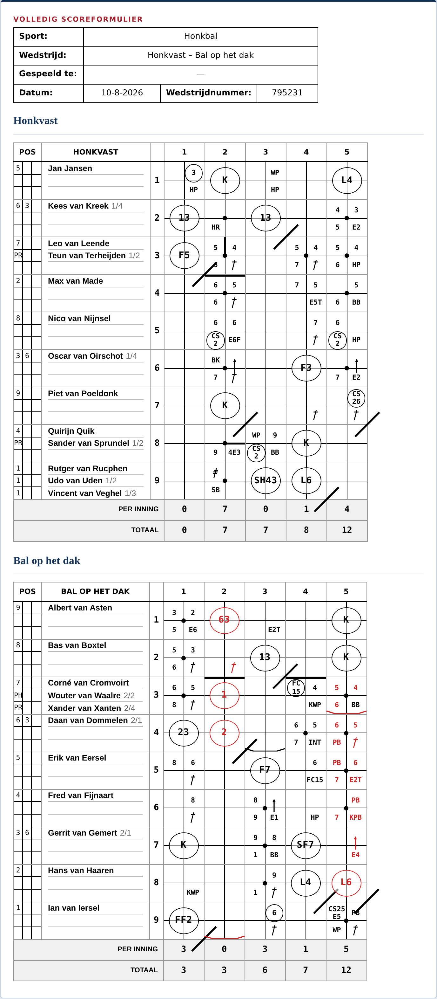

# KNBSB Scorer 1 – Oefentrainer

**▶ [Speel de oefentrainer](https://spoorcc.github.io/knbsb-scorer1/)**

Een gratis, browser-gebaseerde oefentrainer voor het **KNBSB "Scorer 1"**
scorekeeping-examen (honkbal en softbal). De app simuleert een wedstrijd
tussen twee teams, presenteert steeds een speelsituatie in het Nederlands en
laat je de bijbehorende scorekeeping-notatie invullen (bijv. `1B`, `BB`,
`6-3`, `FC1`) — via het honkvakje op het scherm of een virtueel
toetsenbord — waarna direct wordt gecontroleerd of je antwoord klopt.

Elke wedstrijd is herhaalbaar: via een wedstrijdnummer in de URL
(`?wedstrijd=...`) speel je exact dezelfde situaties opnieuw, handig om een
lastige speelsituatie nogmaals te oefenen of te delen.

Wedstrijdnummer `795231` (5 innings, Honkbal) lijkt van alle mogelijke
wedstrijden qua plays het meest op de voorbeeldwedstrijd uit de officiële
cursus (zie [`analysis/`](./analysis) voor de methodiek):

[](https://spoorcc.github.io/knbsb-scorer1/?innings=5&sport=Honkbal&wedstrijd=795231)

Geen installatie nodig — de app draait volledig in de browser, er wordt
niets opgeslagen of verzonden.

## Lokaal draaien

De app is één self-contained bestand: open `index.html` gewoon in een
browser.

Voor development (tests en linters):

```sh
npm install
npm run verify   # lint + test
```

Zie [`CLAUDE.md`](./CLAUDE.md) voor een uitgebreidere beschrijving van de
codebase en architectuur.

## Licentie

[CC BY-SA 4.0](./LICENSE)
